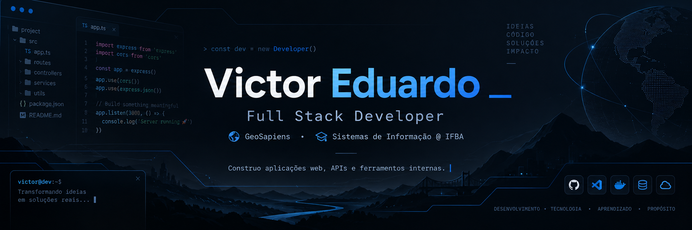

<div align="center">



<br/>

[](https://git.io/typing-svg)

[](https://www.linkedin.com/in/victoreduardopereiramorais/)
[](mailto:victororg22@gmail.com)

</div>

```console
victor@github:~$ ./boot.sh
[  OK  ] Carregando perfil de victor...
[  OK  ] Montando /stack (python, react, typescript, java)
[  OK  ] Iniciando coffee.service
[  OK  ] Conectando frontend <-> backend
[ WARN ] sleep.service não encontrado
[  OK  ] Sistema pronto. Bem-vindo(a) 👋
```

---

### `victor@github:~$ cat victor.json`

```json
{
  "name": "Victor Eduardo",
  "role": "Full Stack Developer",
  "currentlyAt": "GeoSapiens",
  "education": "Sistemas de Informação @ IFBA",

  "about": "Construo aplicações web, APIs e ferramentas internas que resolvem problema de verdade. Base em Python, hoje no dia a dia com Java + Spring + React.",

  "stack": {
    "main": ["Python", "React", "TypeScript", "PostgreSQL"],
    "backend": ["FastAPI", "Flask", "Django", "Node.js", "Spring"],
    "nowUsing": ["Java", "Spring", "React", "Maven"]
  },

  "iLikeBuilding": ["APIs REST", "Sistemas internos", "Automações", "Interfaces simples"],

  "experience": [
    {
      "company": "GeoSapiens",
      "role": "Full Stack Developer",
      "period": "2026 → atual",
      "did": "Features, correções e testes em aplicações web, do front ao back",
      "stack": ["Java", "Spring", "React", "TypeScript", "PostgreSQL"]
    },
    {
      "company": "Motopel Honda",
      "role": "Software Developer",
      "period": "2026",
      "did": "Sistemas internos, interfaces e automações",
      "stack": ["Python", "React", "Angular", "JavaScript"]
    },
    {
      "company": "Pirelli",
      "role": "Front-End Developer | Data Analyst Intern",
      "period": "abr/2025 → mar/2026",
      "did": [
        "Aplicações web do zero com Flask, React, Angular e PostgreSQL",
        "ETL e visualização de dados industriais com Pandas",
        "Dashboards e relatórios estratégicos",
        "Treinamento técnico de novos estagiários"
      ],
      "stack": ["Python", "Pandas", "Flask", "React", "Angular", "Qlik Sense"]
    },
    {
      "company": "CEPEDI",
      "role": "Residência em Software | Front-End & UX/UI",
      "period": "jul/2024 → dez/2024",
      "did": "Prototipação no Figma e desenvolvimento de interfaces",
      "stack": ["React", "JavaScript", "Figma"]
    }
  ],

  "status": "aberto a conversar sobre projetos e oportunidades 🚀"
}
```

---

### `victor@github:~$ ls ~/stack --icons`

<div align="center">


<br/>


</div>

---

### `victor@github:~$ cat ~/.victorrc`

```bash
# configurações pessoais de como eu trabalho

export BUILD="produtos úteis, não só features"
export UI="simples"
export SYSTEMS="fáceis de manter"
export LEARNING="até entender o porquê do código funcionar"

alias repetitivo="automatiza"
alias ship="build && measure && improve"
```

---

### `victor@github:~$ git log --oneline --graph`

```console
* a3f9c21 (HEAD -> main) feat: Full Stack na GeoSapiens
* 7b2e110 feat: automações e sistemas internos na Motopel Honda
* 5c8d4e7 feat: dados industriais + dashboards na Pirelli
* 2f1a9b3 feat: residência Front-End & UX/UI no CEPEDI
* 0e4c7d1 init: Sistemas de Informação no IFBA
* 0000001 initial commit: console.log("hello world")
```

---

<div align="center">

```console
victor@github:~$ exit
logout — obrigado pela visita! bora conversar? 👇
```

[](https://www.linkedin.com/in/victoreduardopereiramorais/)
[](mailto:victororg22@gmail.com)

</div>
