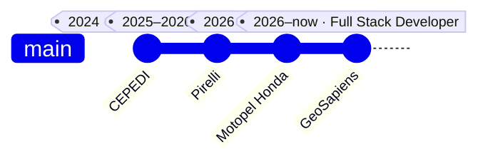

<div align="center">

# `victor@github:~$ whoami`

[](https://git.io/typing-svg)

<p>
  <a href="mailto:victororg22@gmail.com">
    
  </a>
  <a href="https://www.linkedin.com/in/victoreduardopereiramorais/">
    
  </a>
</p>

</div>

---

## `~/victor.config.ts`

```ts
export const victor = {
  role: "Full Stack Developer",
  company: "GeoSapiens",
  education: "Sistemas de Informação @ IFBA",

  strongest: ["Python", "React", "TypeScript", "PostgreSQL"],
  backend: ["FastAPI", "Flask", "Django", "Node.js"],
  shippingWith: ["Java", "Spring", "React", "Maven"],

  building: ["Web Apps", "REST APIs", "Automations", "Internal Tools"],
  mindset: "build → test → ship → improve",
};
```

---

## `git log --career --graph`



<details open>
<summary><b>🚀 GeoSapiens — Full Stack Developer</b></summary>

<br/>

Desenvolvimento e manutenção de aplicações web atuando entre **frontend e backend**, com foco em implementação de funcionalidades, correção de bugs, testes e evolução de sistemas.

`Java` `Spring` `React` `TypeScript` `PostgreSQL` `Maven`

</details>

<details>
<summary><b>🏍️ Motopel Honda — Software Developer</b></summary>

<br/>

Desenvolvimento de aplicações e soluções web voltadas para **automação, interfaces e sistemas internos**.

`Python` `React` `Angular` `JavaScript`

</details>

<details>
<summary><b>🏎️ Pirelli — Front-End Developer | Data Analyst Intern</b> · abr. 2025 → mar. 2026</summary>

<br/>

Desenvolvimento de aplicações web e soluções orientadas a dados para otimização de processos operacionais e administrativos.

- Aplicações web com **Python, Flask, React, Angular e PostgreSQL**
- Extração, transformação e visualização de dados com **Python, Pandas e PostgreSQL**
- Dashboards e relatórios estratégicos
- Manutenção e refatoração de sistemas internos
- Prototipação de interfaces e fluxos no **Figma**
- Atuação em ambiente ágil com **Scrum**
- Apoio e treinamento técnico de novos estagiários

`Python` `Pandas` `Flask` `React` `Angular` `TypeScript` `PostgreSQL` `Figma` `Qlik Sense` `Scrum`

</details>

<details>
<summary><b>🎨 CEPEDI — Residência em Software | Front-End & UX/UI</b> · jul. 2024 → dez. 2024</summary>

<br/>

Residência em desenvolvimento de software com foco em **Frontend, UX/UI e construção de interfaces**, explorando experiência do usuário, prototipação e desenvolvimento de soluções digitais.

`Frontend` `UX/UI` `Figma` `JavaScript` `React`

</details>

---

## `ls ~/toolbox`

<div align="center">


</div>

<br/>

```txt
CORE       Python · React · TypeScript · PostgreSQL
BACKEND    FastAPI · Flask · Django · Node.js
FRONTEND   React · Angular · Vite · HTML · CSS
CURRENT    Java · Spring · Maven
TOOLS      Git · GitHub · VS Code · Postman · Figma
```

---

## `cat focus.txt`

```txt
01  Build useful products — not just features.
02  Keep interfaces simple and systems maintainable.
03  Automate repetitive work whenever it makes sense.
04  Learn deeply enough to understand why the code works.
05  Ship → measure → improve.
```

---

<div align="center">

### `> connection_available`

**Quer falar sobre desenvolvimento, projetos ou oportunidades?**

<a href="mailto:victororg22@gmail.com">Email</a>
&nbsp;&nbsp;•&nbsp;&nbsp;
<a href="https://www.linkedin.com/in/victoreduardopereiramorais/">LinkedIn</a>

<br/><br/>

<sub>Designed like a developer console. Built to be scanned like a résumé.</sub>

</div>
